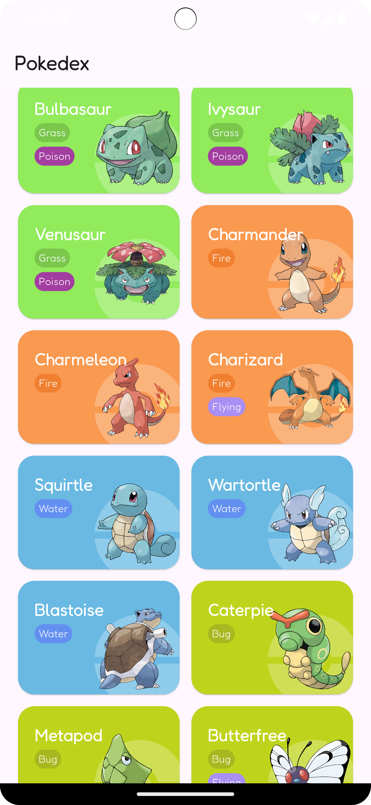
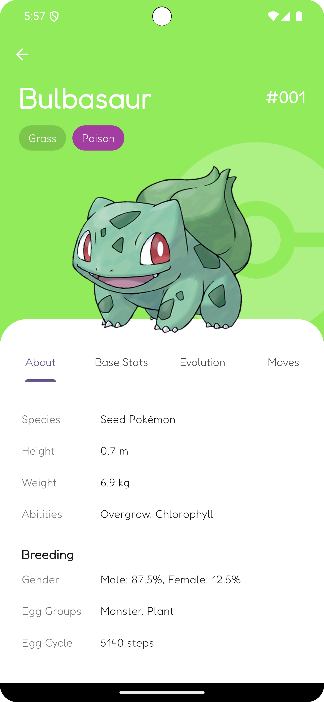
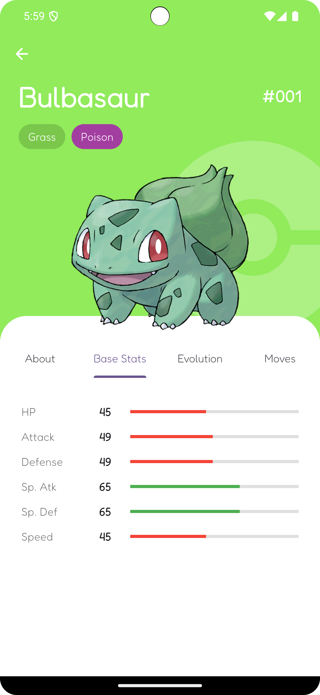
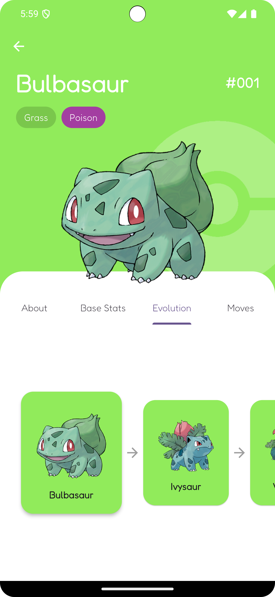
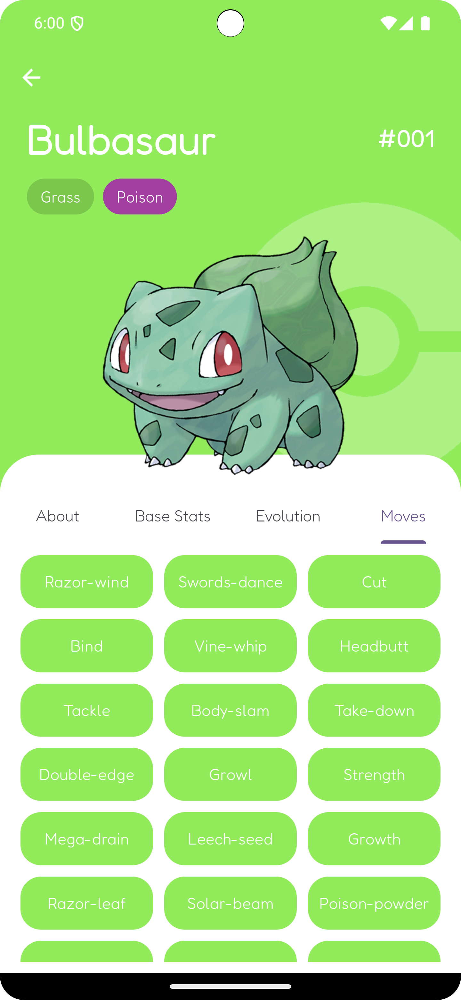
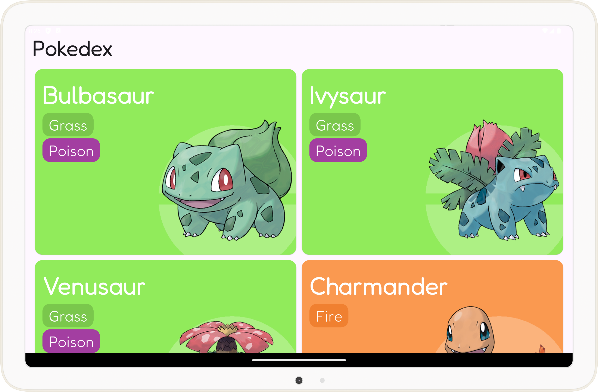
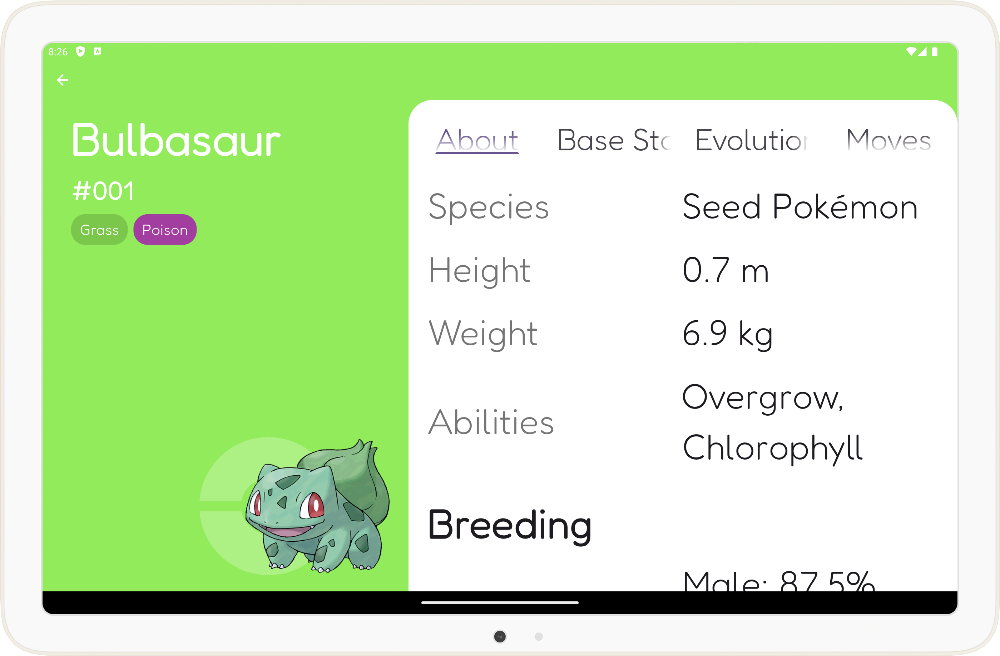
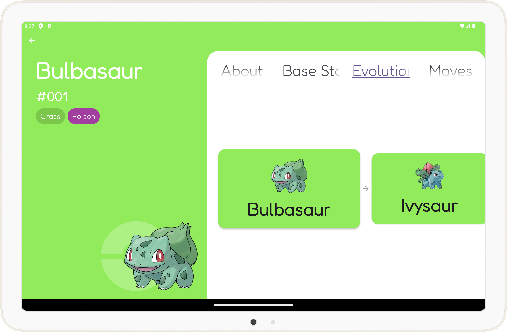
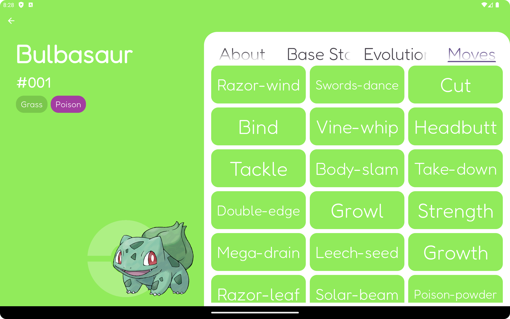

# Pokédex App

A simple Pokédex app built with Flutter that allows users to browse and discover Pokémon.

## Screenshots

### Portrait

| | |
| --- | --- |
|  |  |
|  |  |
|  | |

### Landscape

| | |
| --- | --- |
|  |  |
|  |  |
|  | |

## Features

* **Clean Architecture**: A well-structured and scalable codebase that separates concerns into data, domain, and presentation layers.
* **BLoC for State Management**: A predictable and robust state management solution that makes it easy to manage the state of your app.
* **Responsive UI**: A beautiful and responsive UI that adapts to different screen sizes and orientations.
* **Infinite Scrolling**: A smooth and seamless infinite scrolling experience for browsing Pokémon.
* **Detailed Pokémon Info**: A detailed view of each Pokémon, including its stats, abilities, moves, and evolution chain.

## Architecture

This app is built with a clean architecture approach, which helps to keep the code organized, testable, and maintainable. Here's a breakdown of the layers:

* **Presentation Layer**: This layer is responsible for the UI and user interaction. It uses the BLoC pattern to manage the state of the app and to communicate with the domain layer.
* **Domain Layer**: This layer contains the core business logic of the app. It defines the entities and use cases that are used by the presentation layer.
* **Data Layer**: This layer is responsible for fetching data from the API and providing it to the domain layer. It uses the Repository pattern to abstract the data source from the domain layer.

## Getting Started

To get started with this project, follow these steps:

1. **Clone the repository**: `git clone https://github.com/your-username/pokeapp.git`
2. **Install dependencies**: `flutter pub get`
3. **Run the app**: `flutter run`
